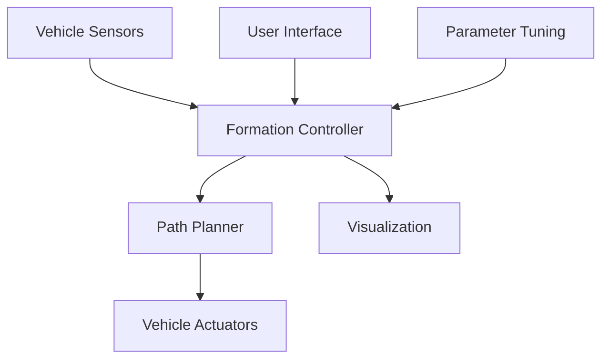

# Multi-Vehicle Formation Control System 🚁

<div align="center">

[](https://www.python.org/downloads/)
[](https://docs.ros.org/en/humble/)
[](LICENSE)
[](CONTRIBUTING.md)

*A comprehensive multi-vehicle formation control and simulation system with both standalone Python simulation and ROS2/Gazebo integration*

[🚀 Quick Start](#quick-start) • [📖 Documentation](#documentation) • [🎮 Demo](#demo) • [🛠️ Development](#development)

</div>

---

## ✨ Features

### 🎯 Core Capabilities
- **Multiple Formation Types**: Line, V-shape, Diamond, Circle formations
- **Intelligent Algorithms**: Artificial potential field, consensus-based control
- **Obstacle Avoidance**: Dynamic window approach (DWA) integration
- **Real-time Visualization**: Interactive matplotlib interface with live parameter adjustment
- **Multi-platform Support**: Standalone Python, ROS2, and embedded systems

### 🔧 Technical Highlights
- **Physics-based Simulation**: Gazebo-compatible vehicle dynamics
- **Distributed Control**: Decentralized formation algorithms
- **Interactive UI**: Real-time parameter tuning and visualization
- **Hardware Ready**: STM32 embedded system integration
- **Scalable Architecture**: Support for 2-20+ vehicles

## 🚀 Quick Start

### Prerequisites
```bash
# Python dependencies
pip install numpy matplotlib

# For ROS2 integration (optional)
sudo apt install ros-humble-desktop
sudo apt install ros-humble-ros-gz
```

### Standalone Simulation
```bash
# Clone the repository
git clone https://github.com/yourusername/multi-vehicle-formation-system.git
cd multi-vehicle-formation-system

# Run interactive demo
python run_formation_demo.py

# Or run directly with parameters
python formation_simulation_standalone.py -n 6 -f v_shape --auto-start
```

### ROS2 + Gazebo Simulation
```bash
# Build and run with Ignition Gazebo
./scripts/build_and_run_ignition.sh -n 8 -f diamond
```

## 🎮 Demo

### Interactive Simulation Interface


**Controls:**
- 🖱️ **Double-click**: Set new target position
- 🎛️ **Right Panel**: Adjust formation type and parameters
- ⏯️ **Buttons**: Start/pause/reset simulation
- 📊 **Real-time Info**: Live formation error and status display

### Formation Types
| Formation | Description | Best Use Case |
|-----------|-------------|---------------|
| 🔹 **Line** | Vehicles in straight line | Highway convoy |
| 🔸 **V-Shape** | V formation with leader | Aerial formations |
| 💎 **Diamond** | Diamond/rhombus pattern | Defensive positions |
| ⭕ **Circle** | Circular formation | Area patrol |

## 📁 Project Structure

```
multi-vehicle-formation-system/
├── 🎯 formation_simulation_standalone.py  # Main standalone simulation
├── 🎮 run_formation_demo.py              # Interactive demo launcher
├── 📚 docs/                              # Documentation
│   ├── algorithm_design.md               # Algorithm details
│   ├── parameter_tuning.md               # Parameter guide
│   └── ignition_gazebo_guide.md          # ROS2/Gazebo setup
├── 🤖 ros2_workspace/                    # ROS2 integration
│   └── src/multi_vehicle_formation/      # ROS2 package
├── 🔧 scripts/                           # Build and run scripts
├── 💻 embedded_system/                   # STM32 embedded code
└── 🧪 tests/                             # Test framework
```

## 📖 Documentation

### Algorithm Design
The system implements multiple formation control algorithms:

- **🧲 Artificial Potential Field**: Attractive and repulsive forces for formation keeping
- **🤝 Consensus-based Control**: Distributed coordination between vehicles
- **🚧 Obstacle Avoidance**: Dynamic window approach for collision-free navigation
- **⚖️ Formation Transitions**: Smooth transitions between different formations

### Key Parameters
```python
# Formation control gains
k_att = 1.0      # Attraction to target
k_rep = 2.0      # Repulsion from neighbors  
k_form = 1.5     # Formation constraint force
k_obstacle = 3.0 # Obstacle avoidance force

# Physical constraints
max_speed = 2.0          # m/s
max_acceleration = 1.0   # m/s²
influence_radius = 3.0   # meters
```

## 🛠️ Development

### Architecture Overview


### Adding New Formations
1. **Define Formation Pattern**: Add new formation type in `FormationController.generate_formation_positions()`
2. **Update UI**: Add to formation selection in control panel
3. **Test**: Run with new formation type

```python
# Example: Adding triangular formation
elif self.formation_type == "triangle":
    # Define triangle vertices
    positions[0] = [0, formation_scale]          # Top
    positions[1] = [-formation_scale, -formation_scale]  # Bottom left
    positions[2] = [formation_scale, -formation_scale]   # Bottom right
```

### Performance Optimization
- **Real-time Factor**: Adjustable simulation speed (0.1x - 3.0x)
- **Update Frequency**: 50Hz physics, 30Hz visualization
- **Scalability**: Tested with up to 20 vehicles
- **Memory Usage**: ~50MB for 10-vehicle simulation

## 🧪 Testing

```bash
# Run unit tests
python -m pytest tests/

# Formation convergence test
python tests/test_formation_convergence.py

# Performance benchmark
python tests/benchmark_performance.py
```

## 🚀 Deployment

### Embedded Systems (STM32)
```bash
# Compile for STM32F4
cd embedded_system
./compile_stm32.sh
./flash_firmware.sh
```

### ROS2 Integration
```bash
# Build ROS2 workspace
cd ros2_workspace
colcon build
source install/setup.bash

# Launch full simulation
ros2 launch multi_vehicle_formation simulation.launch.py
```

## 📊 Performance Metrics

| Metric | Value | Unit |
|--------|-------|------|
| **Formation Error** | < 0.1 | meters |
| **Convergence Time** | 5-15 | seconds |
| **Update Rate** | 50 | Hz |
| **Max Vehicles** | 20+ | count |
| **CPU Usage** | < 30% | single core |

## 🤝 Contributing

We welcome contributions! Please see our [Contributing Guide](CONTRIBUTING.md) for details.

### Development Setup
```bash
# Clone with submodules
git clone --recursive https://github.com/yourusername/multi-vehicle-formation-system.git

# Install development dependencies
pip install -r requirements-dev.txt

# Run pre-commit hooks
pre-commit install
```

## 📄 License

This project is licensed under the MIT License - see the [LICENSE](LICENSE) file for details.

## 🙏 Acknowledgments

- **ROS2 Community** for excellent robotics framework
- **Gazebo Team** for physics simulation engine
- **NumPy/Matplotlib** for scientific computing and visualization
- **Formation Control Research** community for algorithmic foundations

## 📞 Support

- 📧 **Email**: your.email@example.com
- 💬 **Discussions**: [GitHub Discussions](https://github.com/yourusername/multi-vehicle-formation-system/discussions)
- 🐛 **Issues**: [GitHub Issues](https://github.com/yourusername/multi-vehicle-formation-system/issues)
- 📖 **Wiki**: [Project Wiki](https://github.com/yourusername/multi-vehicle-formation-system/wiki)

---

<div align="center">

**⭐ Star this repo if you find it helpful! ⭐**

*Made with ❤️ for the robotics community*

</div> 