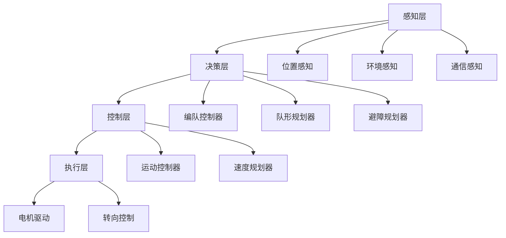

# 多车编队控制算法设计文档

## 1. 算法概述

### 1.1 设计目标
- 实现多车辆的稳定编队控制
- 支持动态队形变换
- 具备分布式控制能力
- 集成避障与路径规划

### 1.2 核心算法框架


## 2. 编队控制算法

### 2.1 基于人工势场的编队控制

#### 2.1.1 势场函数设计
**吸引势场** - 向目标位置移动：
```
U_att(x) = 1/2 * k_att * ||x - x_goal||^2
```

**排斥势场** - 避免碰撞：
```
U_rep(x) = 1/2 * k_rep * (1/d - 1/d0)^2  if d < d0
         = 0                              if d >= d0
```

**编队势场** - 保持队形：
```
U_form(x) = 1/2 * k_form * ||x - x_desired||^2
```

#### 2.1.2 合力计算
```cpp
Vector2D calculateFormationForce(const VehicleState& state, 
                                const FormationConfig& config) {
    Vector2D F_total(0, 0);
    
    // 目标吸引力
    Vector2D F_att = -k_att * (state.position - config.target_position);
    
    // 邻车排斥力
    for (const auto& neighbor : state.neighbors) {
        Vector2D F_rep = calculateRepulsiveForce(state.position, neighbor.position);
        F_total += F_rep;
    }
    
    // 编队约束力
    Vector2D F_form = calculateFormationForce(state.position, config.desired_position);
    
    F_total = F_att + F_form;
    return F_total;
}
```

### 2.2 基于共识算法的分布式控制

#### 2.2.1 共识协议
```
ẋᵢ = Σⱼ∈Nᵢ aᵢⱼ(xⱼ - xᵢ) + uᵢ
```

其中：
- `xᵢ` - 第i个智能体的状态
- `aᵢⱼ` - 智能体i和j之间的通信权重
- `uᵢ` - 控制输入

#### 2.2.2 编队控制实现
```cpp
class ConsensusController {
private:
    double consensus_gain_;
    std::vector<double> formation_offset_;
    
public:
    Vector2D calculateConsensusControl(const VehicleState& state,
                                     const std::vector<VehicleState>& neighbors) {
        Vector2D consensus_term(0, 0);
        
        for (const auto& neighbor : neighbors) {
            Vector2D relative_pos = neighbor.position - state.position;
            Vector2D desired_relative = calculateDesiredRelativePosition(state.id, neighbor.id);
            Vector2D error = relative_pos - desired_relative;
            
            consensus_term += consensus_gain_ * error;
        }
        
        return consensus_term;
    }
};
```

## 3. 队形变换算法

### 3.1 队形定义
支持的标准队形：
- **一字形编队**: 车辆呈直线排列
- **V字形编队**: 车辆呈V字形排列  
- **楔形编队**: 车辆呈楔形排列
- **菱形编队**: 车辆呈菱形排列
- **圆形编队**: 车辆呈圆形排列

### 3.2 队形变换策略

#### 3.2.1 轨迹规划
```cpp
class FormationTransition {
private:
    double transition_time_;
    InterpolationType interp_type_;
    
public:
    std::vector<Trajectory> planTransition(const Formation& current_formation,
                                         const Formation& target_formation) {
        std::vector<Trajectory> trajectories;
        
        for (int i = 0; i < current_formation.size(); i++) {
            Vector2D start_pos = current_formation[i].position;
            Vector2D end_pos = target_formation[i].position;
            
            // 使用B样条插值生成平滑轨迹
            Trajectory traj = generateBSplineTrajectory(start_pos, end_pos, transition_time_);
            trajectories.push_back(traj);
        }
        
        return trajectories;
    }
};
```

#### 3.2.2 冲突检测与避免
```cpp
bool checkTrajectoryConflict(const std::vector<Trajectory>& trajectories) {
    for (int i = 0; i < trajectories.size(); i++) {
        for (int j = i + 1; j < trajectories.size(); j++) {
            if (trajectoryIntersection(trajectories[i], trajectories[j])) {
                return true;  // 检测到冲突
            }
        }
    }
    return false;
}
```

## 4. 避障算法

### 4.1 动态窗口法 (DWA)

#### 4.1.1 速度空间采样
```cpp
struct VelocityWindow {
    double v_min, v_max;    // 线速度范围
    double w_min, w_max;    // 角速度范围
    double v_res, w_res;    // 采样分辨率
};

std::vector<VelocityCommand> sampleVelocities(const VelocityWindow& window) {
    std::vector<VelocityCommand> commands;
    
    for (double v = window.v_min; v <= window.v_max; v += window.v_res) {
        for (double w = window.w_min; w <= window.w_max; w += window.w_res) {
            commands.push_back({v, w});
        }
    }
    
    return commands;
}
```

#### 4.1.2 轨迹评估
```cpp
double evaluateTrajectory(const VelocityCommand& cmd,
                         const VehicleState& state,
                         const std::vector<Obstacle>& obstacles) {
    // 预测轨迹
    Trajectory predicted = predictTrajectory(state, cmd, prediction_time_);
    
    // 计算评估函数
    double heading_score = calculateHeadingScore(predicted, target_heading_);
    double clearance_score = calculateClearanceScore(predicted, obstacles);
    double velocity_score = calculateVelocityScore(cmd);
    
    return alpha_ * heading_score + beta_ * clearance_score + gamma_ * velocity_score;
}
```

### 4.2 人工势场避障

#### 4.2.1 障碍物势场
```cpp
Vector2D calculateObstacleRepulsion(const Vector2D& position,
                                   const std::vector<Obstacle>& obstacles) {
    Vector2D total_force(0, 0);
    
    for (const auto& obstacle : obstacles) {
        double distance = (position - obstacle.position).norm();
        
        if (distance < obstacle_influence_radius_) {
            Vector2D direction = (position - obstacle.position).normalized();
            double magnitude = k_obstacle_ * (1.0/distance - 1.0/obstacle_influence_radius_) 
                             * (1.0/distance/distance);
            total_force += magnitude * direction;
        }
    }
    
    return total_force;
}
```

## 5. 通信协议

### 5.1 车间通信协议
```cpp
struct VehicleMessage {
    uint32_t vehicle_id;
    uint32_t timestamp;
    Vector2D position;
    Vector2D velocity;
    double heading;
    FormationState formation_state;
    uint8_t checksum;
};

class CommunicationManager {
private:
    std::map<uint32_t, VehicleMessage> neighbor_states_;
    double communication_range_;
    
public:
    void broadcastState(const VehicleState& state);
    std::vector<VehicleMessage> getNeighborStates();
    bool isInCommunicationRange(uint32_t vehicle_id);
};
```

### 5.2 消息同步机制
```cpp
class MessageSynchronizer {
private:
    std::queue<VehicleMessage> message_buffer_;
    double max_delay_tolerance_;
    
public:
    void synchronizeMessages(std::vector<VehicleMessage>& messages) {
        // 基于时间戳的消息同步
        std::sort(messages.begin(), messages.end(), 
                 [](const VehicleMessage& a, const VehicleMessage& b) {
                     return a.timestamp < b.timestamp;
                 });
        
        // 移除过期消息
        auto current_time = getCurrentTimestamp();
        messages.erase(
            std::remove_if(messages.begin(), messages.end(),
                          [&](const VehicleMessage& msg) {
                              return (current_time - msg.timestamp) > max_delay_tolerance_;
                          }),
            messages.end());
    }
};
```

## 6. 参数配置

### 6.1 控制参数
```yaml
formation_control:
  potential_field:
    k_att: 1.0          # 吸引力增益
    k_rep: 2.0          # 排斥力增益
    k_form: 1.5         # 编队力增益
    influence_radius: 3.0  # 影响半径
  
  consensus:
    consensus_gain: 0.5  # 共识增益
    convergence_threshold: 0.1  # 收敛阈值
  
  safety:
    min_distance: 1.0    # 最小安全距离
    max_velocity: 2.0    # 最大速度
    max_acceleration: 1.0  # 最大加速度
```

### 6.2 通信参数
```yaml
communication:
  protocol: "UDP"
  port: 8888
  broadcast_frequency: 10  # Hz
  max_packet_size: 1024   # bytes
  timeout: 1000          # ms
  retry_count: 3
```

## 7. 性能分析

### 7.1 稳定性分析
- **Lyapunov稳定性**: 证明系统在编队势场下的渐近稳定性
- **鲁棒性分析**: 分析系统对扰动和通信延迟的鲁棒性

### 7.2 计算复杂度
- **时间复杂度**: O(n²) - n为车辆数量
- **空间复杂度**: O(n) - 主要存储邻车状态信息
- **通信复杂度**: O(n) - 每个车辆需要与邻车通信

## 8. 优化策略

### 8.1 算法优化
- **分层控制**: 将编队控制分解为多个层次
- **预测控制**: 引入模型预测控制提高性能
- **自适应参数**: 根据环境动态调整控制参数

### 8.2 实现优化
- **并行计算**: 利用多核处理器并行计算
- **数据结构优化**: 使用高效的数据结构存储状态信息
- **内存管理**: 优化内存使用减少实时性影响

## 9. 仿真验证

### 9.1 仿真场景
- **基础编队**: 测试基本编队控制性能
- **队形变换**: 验证动态队形变换能力
- **避障测试**: 测试复杂环境下的避障性能
- **通信故障**: 验证系统的容错能力

### 9.2 性能指标
- **编队误差**: 衡量编队精度
- **收敛时间**: 编队形成或变换的时间
- **能耗效率**: 系统总体能耗
- **安全性**: 碰撞避免成功率 