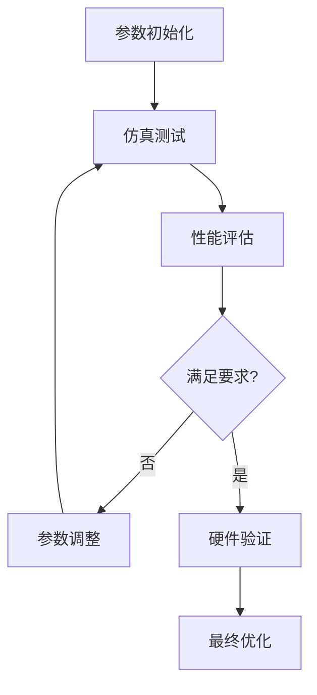

# 参数调试指南

## 1. 参数调试概述

### 1.1 调试目标
- 获得稳定的编队控制性能
- 实现快速的队形变换
- 确保系统安全性和鲁棒性
- 优化能耗和计算效率

### 1.2 调试流程


## 2. 关键参数分类

### 2.1 编队控制参数

#### 2.1.1 人工势场参数
```yaml
potential_field:
  k_att: 1.0          # 目标吸引力增益
  k_rep: 2.0          # 邻车排斥力增益  
  k_form: 1.5         # 编队约束力增益
  k_obstacle: 3.0     # 障碍物排斥力增益
  
  influence_radius: 3.0     # 势场影响半径 (m)
  obstacle_radius: 2.0      # 障碍物影响半径 (m)
  safety_distance: 1.0      # 最小安全距离 (m)
```

**调试建议**:
- `k_att` 过大会导致系统震荡，过小会导致收敛缓慢
- `k_rep` 需要与 `k_att` 平衡，避免车辆聚集或分散
- `k_form` 决定编队保持的严格程度

#### 2.1.2 共识算法参数
```yaml
consensus:
  consensus_gain: 0.5       # 共识增益
  damping_factor: 0.8       # 阻尼系数
  convergence_threshold: 0.1 # 收敛阈值 (m)
  max_iterations: 100       # 最大迭代次数
```

### 2.2 运动控制参数

#### 2.2.1 速度控制
```yaml
motion_control:
  max_linear_velocity: 2.0   # 最大线速度 (m/s)
  max_angular_velocity: 1.0  # 最大角速度 (rad/s)
  max_acceleration: 1.0      # 最大加速度 (m/s²)
  max_deceleration: 1.5      # 最大减速度 (m/s²)
  
  velocity_smoothing: 0.9    # 速度平滑系数
  angular_smoothing: 0.8     # 角速度平滑系数
```

#### 2.2.2 PID控制器
```yaml
pid_controller:
  linear_velocity:
    kp: 1.0
    ki: 0.1
    kd: 0.05
    max_integral: 10.0
    
  angular_velocity:
    kp: 2.0
    ki: 0.2
    kd: 0.1
    max_integral: 5.0
```

### 2.3 避障参数

#### 2.3.1 动态窗口法参数
```yaml
dwa:
  prediction_time: 2.0       # 预测时间 (s)
  velocity_resolution: 0.1   # 速度采样分辨率
  angular_resolution: 0.1    # 角速度采样分辨率
  
  # 评估函数权重
  heading_weight: 0.4        # 方向得分权重
  clearance_weight: 0.3      # 距离得分权重
  velocity_weight: 0.3       # 速度得分权重
```

## 3. 参数调试方法

### 3.1 单参数调试法

#### 3.1.1 步骤
1. 固定其他参数
2. 在合理范围内变化目标参数
3. 记录性能指标
4. 选择最优参数值

#### 3.1.2 示例：调试吸引力增益
```python
def tune_attraction_gain():
    k_att_range = np.linspace(0.1, 3.0, 30)
    results = []
    
    for k_att in k_att_range:
        # 设置参数
        config = FormationConfig()
        config.k_att = k_att
        
        # 运行仿真
        metrics = run_simulation(config)
        results.append({
            'k_att': k_att,
            'formation_error': metrics.formation_error,
            'convergence_time': metrics.convergence_time,
            'stability': metrics.stability_score
        })
    
    # 分析结果
    optimal_k_att = find_optimal_parameter(results)
    return optimal_k_att
```

### 3.2 多参数优化

#### 3.2.1 遗传算法优化
```python
import numpy as np
from scipy.optimize import differential_evolution

def objective_function(params):
    """目标函数：最小化编队误差和收敛时间"""
    k_att, k_rep, k_form = params
    
    config = FormationConfig(k_att=k_att, k_rep=k_rep, k_form=k_form)
    metrics = run_simulation(config)
    
    # 多目标优化：编队误差 + 收敛时间
    score = 0.6 * metrics.formation_error + 0.4 * metrics.convergence_time
    return score

# 参数边界
bounds = [(0.1, 3.0),  # k_att
          (0.1, 5.0),  # k_rep  
          (0.1, 3.0)]  # k_form

# 遗传算法优化
result = differential_evolution(objective_function, bounds, maxiter=100)
optimal_params = result.x
```

#### 3.2.2 粒子群优化 (PSO)
```python
class PSO_Optimizer:
    def __init__(self, n_particles=20, n_iterations=50):
        self.n_particles = n_particles
        self.n_iterations = n_iterations
        
    def optimize(self, objective_func, bounds):
        # 初始化粒子群
        particles = self.initialize_particles(bounds)
        
        for iteration in range(self.n_iterations):
            # 评估每个粒子
            for particle in particles:
                fitness = objective_func(particle.position)
                particle.update_fitness(fitness)
            
            # 更新全局最优
            global_best = min(particles, key=lambda p: p.best_fitness)
            
            # 更新粒子位置和速度
            for particle in particles:
                particle.update_velocity(global_best.position)
                particle.update_position()
        
        return global_best.position
```

## 4. 性能评估指标

### 4.1 编队性能指标

#### 4.1.1 编队误差
```python
def calculate_formation_error(positions, desired_formation):
    """计算编队误差"""
    total_error = 0.0
    n_vehicles = len(positions)
    
    for i in range(n_vehicles):
        error = np.linalg.norm(positions[i] - desired_formation[i])
        total_error += error
    
    return total_error / n_vehicles

def calculate_formation_stability(error_history):
    """计算编队稳定性"""
    if len(error_history) < 10:
        return 0.0
    
    # 计算误差方差
    recent_errors = error_history[-10:]
    stability = 1.0 / (1.0 + np.var(recent_errors))
    return stability
```

#### 4.1.2 收敛性能
```python
def analyze_convergence(error_history, threshold=0.1):
    """分析收敛性能"""
    convergence_time = None
    steady_state_error = None
    
    # 找到首次收敛时间
    for i, error in enumerate(error_history):
        if error < threshold:
            convergence_time = i * 0.1  # 假设采样时间0.1s
            break
    
    # 计算稳态误差
    if len(error_history) > 50:
        steady_state_error = np.mean(error_history[-50:])
    
    return convergence_time, steady_state_error
```

### 4.2 安全性指标

#### 4.2.1 碰撞检测
```python
def check_collision_safety(vehicle_positions, safety_radius=1.0):
    """检查车辆间碰撞安全性"""
    n_vehicles = len(vehicle_positions)
    min_distance = float('inf')
    collision_count = 0
    
    for i in range(n_vehicles):
        for j in range(i+1, n_vehicles):
            distance = np.linalg.norm(vehicle_positions[i] - vehicle_positions[j])
            min_distance = min(min_distance, distance)
            
            if distance < safety_radius:
                collision_count += 1
    
    return min_distance, collision_count
```

### 4.3 效率指标

#### 4.3.1 能耗评估
```python
def calculate_energy_consumption(velocity_history, control_history):
    """计算能耗"""
    total_energy = 0.0
    dt = 0.1  # 采样时间
    
    for i in range(len(velocity_history)):
        # 运动能耗
        kinetic_energy = 0.5 * (velocity_history[i]**2)
        
        # 控制能耗
        control_energy = np.sum(np.abs(control_history[i]))
        
        total_energy += (kinetic_energy + control_energy) * dt
    
    return total_energy
```

## 5. 调试工具和方法

### 5.1 可视化调试

#### 5.1.1 实时参数监控
```python
import matplotlib.pyplot as plt
from matplotlib.animation import FuncAnimation

class ParameterMonitor:
    def __init__(self):
        self.fig, self.axes = plt.subplots(2, 2, figsize=(12, 8))
        self.error_history = []
        self.param_history = {}
        
    def update_plot(self, frame):
        # 清除旧图
        for ax in self.axes.flat:
            ax.clear()
        
        # 绘制编队误差
        self.axes[0,0].plot(self.error_history)
        self.axes[0,0].set_title('Formation Error')
        
        # 绘制参数变化
        for param_name, values in self.param_history.items():
            self.axes[0,1].plot(values, label=param_name)
        self.axes[0,1].set_title('Parameter Changes')
        self.axes[0,1].legend()
        
        # 绘制车辆轨迹
        # ... (添加轨迹绘制代码)
        
    def start_monitoring(self):
        animation = FuncAnimation(self.fig, self.update_plot, interval=100)
        plt.show()
```

#### 5.1.2 参数敏感性分析
```python
def sensitivity_analysis(base_config, param_ranges):
    """参数敏感性分析"""
    sensitivity_results = {}
    
    for param_name, param_range in param_ranges.items():
        results = []
        
        for param_value in param_range:
            # 创建配置副本
            config = copy.deepcopy(base_config)
            setattr(config, param_name, param_value)
            
            # 运行仿真
            metrics = run_simulation(config)
            results.append({
                'param_value': param_value,
                'performance': metrics.overall_score
            })
        
        sensitivity_results[param_name] = results
    
    return sensitivity_results
```

### 5.2 自动调试系统

#### 5.2.1 贝叶斯优化
```python
from skopt import gp_minimize
from skopt.space import Real

def bayesian_optimization():
    """贝叶斯优化参数调试"""
    
    # 定义参数空间
    space = [
        Real(0.1, 3.0, name='k_att'),
        Real(0.1, 5.0, name='k_rep'),
        Real(0.1, 3.0, name='k_form'),
        Real(0.1, 2.0, name='consensus_gain')
    ]
    
    def objective(params):
        k_att, k_rep, k_form, consensus_gain = params
        
        config = FormationConfig(
            k_att=k_att,
            k_rep=k_rep, 
            k_form=k_form,
            consensus_gain=consensus_gain
        )
        
        metrics = run_simulation(config)
        return metrics.overall_score  # 最小化目标函数
    
    # 贝叶斯优化
    result = gp_minimize(objective, space, n_calls=100, random_state=42)
    
    return result.x  # 最优参数
```

## 6. 常见问题和解决方案

### 6.1 编队不稳定

**现象**: 车辆在编队中出现震荡或发散

**可能原因**:
- 吸引力增益过大
- 排斥力增益过小
- 通信延迟导致反馈滞后

**解决方案**:
```python
# 调整参数建议
def fix_formation_instability(config):
    # 降低吸引力增益
    config.k_att *= 0.8
    
    # 增加阻尼系数
    config.damping_factor = 0.9
    
    # 增加平滑滤波
    config.velocity_smoothing = 0.95
    
    return config
```

### 6.2 收敛速度慢

**现象**: 编队形成或队形变换时间过长

**解决方案**:
```python
def improve_convergence_speed(config):
    # 适当增加吸引力增益
    config.k_att *= 1.2
    
    # 增加共识增益
    config.consensus_gain *= 1.1
    
    # 减小收敛阈值
    config.convergence_threshold *= 0.8
    
    return config
```

### 6.3 避障性能差

**现象**: 车辆无法有效避开障碍物

**解决方案**:
```python
def improve_obstacle_avoidance(config):
    # 增加障碍物排斥力
    config.k_obstacle *= 1.5
    
    # 扩大障碍物影响半径
    config.obstacle_radius *= 1.2
    
    # 增加预测时间
    config.prediction_time *= 1.3
    
    return config
```

## 7. 参数配置文件模板

### 7.1 基础配置
```yaml
# formation_params.yaml
formation_control:
  algorithm_type: "potential_field"  # potential_field, consensus, hybrid
  
  potential_field:
    k_att: 1.0
    k_rep: 2.0
    k_form: 1.5
    k_obstacle: 3.0
    influence_radius: 3.0
    obstacle_radius: 2.0
    
  consensus:
    consensus_gain: 0.5
    damping_factor: 0.8
    convergence_threshold: 0.1
    
  safety:
    min_distance: 1.0
    max_velocity: 2.0
    max_acceleration: 1.0
    
  communication:
    update_frequency: 10  # Hz
    max_delay: 0.5       # seconds
    
# 性能参数
performance:
  formation_error_threshold: 0.2
  convergence_time_limit: 10.0
  safety_margin: 0.5
```

### 7.2 高级配置
```yaml
# advanced_params.yaml
adaptive_control:
  enable: true
  adaptation_rate: 0.01
  parameter_bounds:
    k_att: [0.1, 3.0]
    k_rep: [0.1, 5.0]
    
optimization:
  method: "genetic_algorithm"  # genetic_algorithm, pso, bayesian
  population_size: 20
  max_generations: 50
  mutation_rate: 0.1
  
logging:
  enable_parameter_log: true
  log_frequency: 1  # Hz
  log_file: "parameter_tuning.log"
```

## 8. 调试检查清单

### 8.1 基础检查
- [ ] 参数值在合理范围内
- [ ] 配置文件格式正确
- [ ] 仿真环境设置正确
- [ ] 通信链路正常

### 8.2 性能检查
- [ ] 编队误差 < 0.2m
- [ ] 收敛时间 < 10s
- [ ] 无车辆碰撞
- [ ] 系统稳定运行

### 8.3 鲁棒性检查
- [ ] 通信延迟测试
- [ ] 噪声干扰测试
- [ ] 车辆故障测试
- [ ] 动态障碍物测试

通过系统性的参数调试，可以获得稳定、高效的多车编队控制系统。建议结合仿真测试和实际硬件验证，确保参数的实用性和可靠性。 